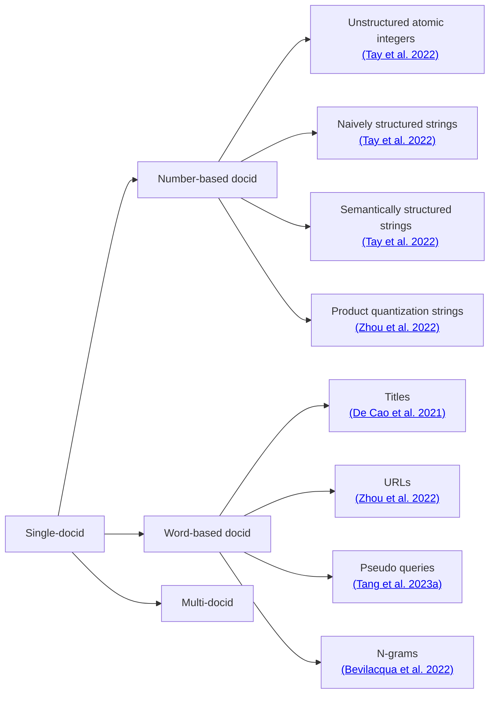

# Identifier Design Roadmap

This roadmap provides an overview of predefined document identifier (docid) design strategies in GenIR. 
Docid design is typically organized around two major categories: **Single-docid** (using one docid to represent the doc) and **Multi-docid** (using multiple docids to represent the doc). 
A *Single docid* can be constructed using either **number-based docids** or **word-based docids**, each representing different encoding principles. 
These individual docid types can also be combined or extended to form **Multi-docid** structures, which aim to capture richer or more diverse document representations.

The diagram below summarizes the relationships among these design families and lists representative approaches for each category.

# TODO
- [ ] Add training roadmap

